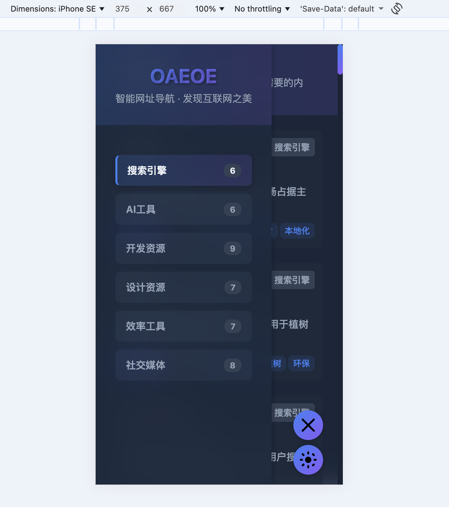

# MDNav - 智能网址导航系统

MDNav 是一个基于 Go 语言开发的智能网址导航系统，通过解析 Markdown 文件生成静态导航网站，支持分类管理、标签搜索、响应式设计等特性。


 

 


## 功能特性

- **Markdown 驱动**：使用 Markdown 文件管理导航链接，易于维护和更新
- **分类管理**：支持多级分类，清晰组织不同类型的网址
- **标签搜索**：通过标签快速筛选和查找相关网站
- **响应式设计**：适配不同屏幕尺寸的设备
- **实时文件监控**：开发模式下自动监测文件变化并重新加载
- **高性能**：基于 Go 语言开发，性能优异
- **自定义配置**：通过配置文件灵活调整网站信息和行为

## 技术栈

- **后端**：Go 1.25.6
- **Web 框架**：Gin
- **Markdown 解析**：Goldmark
- **日志库**：Zap
- **文件监控**：FSNotify
- **配置管理**：Viper
- **前端**：HTML、CSS、JavaScript

## 项目结构

```
├── contents/           # Markdown 文件存储目录
│   ├── ai-tools/       # AI 工具分类
│   ├── design-resources/ # 设计资源分类
│   ├── development-resources/ # 开发资源分类
│   ├── productivity-tools/ # 生产力工具分类
│   ├── search-engine/  # 搜索引擎分类
│   └── social-media/   # 社交媒体分类
├── internal/           # 核心 Go 代码
│   ├── conf/           # 配置管理
│   ├── core/           # 核心上下文
│   ├── handler/        # HTTP 处理器
│   ├── middleware/     # 中间件
│   ├── models/         # 数据模型
│   ├── pkg/            # 工具包
│   ├── router/         # 路由配置
│   ├── service/        # 业务逻辑
│   └── utils/          # 工具函数
├── tpl/                # 模板文件和静态资源
│   ├── assets/         # 静态资源
│   └── *.html          # 模板文件
├── config.yaml         # 配置文件
├── go.mod              # Go 模块文件
├── go.sum              # Go 依赖校验文件
├── main.go             # 项目入口
└── README.md           # 项目说明文档
```

## 安装与配置

### 前置要求

- Go 1.25.6 或更高版本

### 安装步骤

1. 克隆项目到本地

```bash
git clone https://github.com/yourusername/mdnav.git
cd mdnav
```

2. 安装依赖

```bash
go mod tidy
```

3. 配置项目

编辑 `config.yaml` 文件，根据需要修改配置：

```yaml
server:
  port: "0.0.0.0:8081"     # 服务器端口
  content_dir: "./contents/" # Markdown 文件目录
  resset: ""

site:
  name: "OAEOE"            # 网站名称
  keywords: "导航网站, 导航网址, 网址导航, 网站导航" # 网站关键词
  description: "智能网址导航，发现互联网之美，这是你进入各大网站的门户。" # 网站描述
  summary: "智能网址导航 · 发现互联网之美" # 网站摘要
  logo_path: ""             # Logo 路径
  favicon: ""               # 网站图标
  copyright: "探索精彩网站"    # 版权信息

template:
  dir: "tpl"               # 模板目录
  default: "index.html"     # 默认模板
  static_dir: "tpl/assets"  # 静态资源目录
```

## 使用方法

### 启动项目

开发模式（启用文件监控）：

```bash
go run main.go debug
```

生产模式：

```bash
go run main.go
```

或编译后运行：

```bash
go build -o mdnav main.go
./mdnav
```

### 访问网站

启动后，通过浏览器访问：`http://localhost:8081`

### 管理文档

1. **添加新分类**：在 `contents/` 目录下创建新文件夹，并在其中添加 `_index.md` 文件作为分类说明

2. **添加新链接**：在对应分类目录下创建 Markdown 文件，文件格式示例：

```markdown
---
title: GitHub
description: 全球最大的代码托管平台
url: https://github.com
tags:
  - 开发
  - 代码托管
---

GitHub 是一个面向开源及私有软件项目的托管平台，因为只支持 Git 作为唯一的版本库格式进行托管，故名 GitHub。
```

3. **更新配置**：在浏览器中访问 `http://localhost:8081/system/update`（需要基本认证，用户名：admin-manger，密码：admin-oaeoe-password）

## 文档管理

### Markdown 文件格式

每个导航链接对应一个 Markdown 文件，文件格式如下：

```markdown
---
title: 网站标题
description: 网站描述
url: 网站 URL
tags:
  - 标签1
  - 标签2
---

网站详细介绍内容
```

### 分类管理

每个分类目录下需要包含一个 `_index.md` 文件，用于描述分类信息：

```markdown
---
title: 开发资源
description: 开发者常用的工具和资源
---

开发相关的工具和资源集合
```

## 开发与部署

### 开发环境

1. 启动开发模式：`go run main.go debug`
2. 修改 Markdown 文件或模板文件，系统会自动重新加载

### 部署环境

1. 编译项目：`go build -o mdnav main.go`
2. 将编译后的可执行文件和配置文件、内容目录、模板目录部署到服务器
3. 启动服务：`./mdnav`

## 许可证

本项目采用 MIT 许可证，详见 LICENSE 文件。

## 贡献

欢迎提交 Issue 和 Pull Request 来改进这个项目。

## 联系方式

如有问题或建议，欢迎联系项目维护者。

---

**享受探索互联网的乐趣！** 🚀